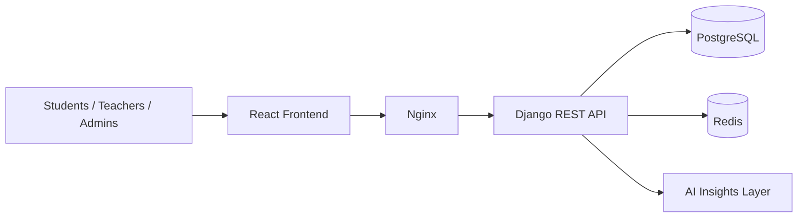
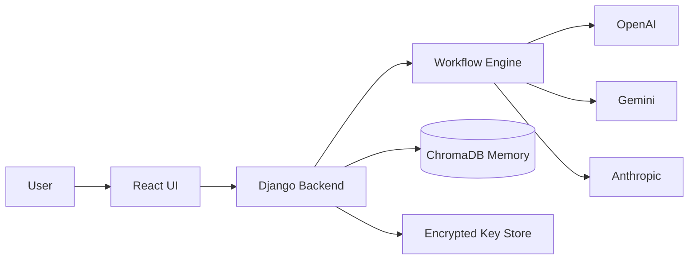

<div align="center">


<a href="https://git.io/typing-svg">
  
</a>

<br />


</div>

---

## 👋 About Me

I'm **Jahongir** (Jonizz), a full-stack developer and AI builder from Tashkent, Uzbekistan.
I build products that solve real problems — mainly in **education**, **automation** and **AI systems** — and I ship them to real users.

```python
class Jahongir:
    role     = "Founder & Full-Stack Engineer"
    location = "Tashkent, Uzbekistan 🇺🇿"
    building = ["Knowza (LMS/CRM for education)", "Unimind (multi-model AI platform)"]
    stack    = ["Django", "React", "PostgreSQL", "Redis", "Docker"]
    ai       = ["OpenAI", "Gemini", "Anthropic", "RAG", "ChromaDB"]
    mindset  = "Ship early, measure, improve"
    open_to  = ["Freelance", "Remote collaboration", "Open-source"]
```

- 🏗️ Building scalable web apps with **Django**, **React** and **PostgreSQL**
- 🤖 Developing AI-powered products with **LLM APIs**, **RAG** and workflow automation
- 🎓 Focused on **EdTech** — tools for private schools and tutoring centers
- 🔐 Caring about backend architecture, security and startup execution

---

## 🛠️ Tech Stack

<div align="center">

**Frontend**


**Backend**


**Database & Infrastructure**


**AI & Automation**


</div>

---

## 🚀 Featured Projects

### 🎓 Knowza — LMS/CRM for Private Schools & Tutoring Centers

An education platform built for private schools and tutoring centers in Uzbekistan. It combines learning management with center operations, and adds analytics and AI on top so teachers and administrators can see how students are really doing.

| | |
|---|---|
| **Users** | Real schools and tutoring centers |
| **Focus** | Learning management, student progress, center operations |
| **AI** | Academic insights and smart study support |
| **Engagement** | Gamification system |
| **Backend** | Secure, scalable API |

**Highlights**
- 📊 Analytics and progress tracking for students, teachers and admins
- 🤖 AI-based academic insights
- 🎮 Gamification to keep students motivated
- 🔒 Secure and scalable backend architecture

**Stack:** `Django REST` `React` `PostgreSQL` `Redis` `Docker`

[](https://knowza-seven.vercel.app)

<details>
<summary><b>🧩 Architecture overview</b></summary>



</details>

---

### 🧠 Unimind — Multi-Model AI Platform

One interface for many AI providers, with long-term memory and workflow-based automation. Built around provider flexibility, so you're never locked into a single model.

**Highlights**
- 🔀 Unified interface for multiple AI providers
- 🧠 Long-term memory with vector storage
- ⚙️ Workflow-based automation
- 🔐 Encrypted API key handling

**Stack:** `React` `Django` `ChromaDB` `OpenAI` `Automation Workflows`

<details>
<summary><b>🧩 Architecture overview</b></summary>



</details>

---

## 📊 GitHub Stats

<div align="center">


<br />


<br />


<br />


<br />


</div>

---

## 🎯 Current Focus

- 🤖 Building AI-powered SaaS products
- 🏗️ Improving backend architecture and security
- ⚡ Exploring scalable automation systems
- 📦 Shipping useful tools for real users

---

## 🤝 Let's Work Together

I'm open to **freelance projects**, **remote collaboration** and **open-source** work — especially around SaaS, EdTech, backend systems and AI integrations.

<div align="center">

[](https://t.me/jonizz_devvvv)
[](mailto:jahongirtuhtaev989@gmail.com)
[](https://www.linkedin.com/in/jakhongir-tukhtaev-473b803b6/)
[](https://github.com/Jonizz14)

</div>

---

<div align="center">


</div>
